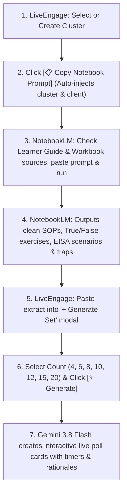

# LearnBlended Poll (LiveEngage) — Master Project Handover & Knowledge Transfer

**Generated**: October 2026  
**System Status**: Production build verified (0 errors), Next.js daemon running on `http://localhost:3000`.  
**Target Environment**: Windows, Node.js, Next.js 14 (App Router), Tailwind CSS, Lucide React.  
**Domain**: Occupational adult training engagement & formative assessment in South Africa (QCTO / SETA Framework, SAQA ID 99446 — Store Person / Dispatching & Receiving Clerk).

---

## 1. Executive Summary & Core Purpose

**LearnBlended Poll (LiveEngage)** is a real-time, interactive classroom polling and formative quiz platform purpose-built for adult workplace training. It solves the engagement and compliance challenges in corporate occupational qualifications by:
1. **Bridging Official Curriculum & Daily Reality**: Translating bulky QCTO Knowledge Modules (KM), Practical Modules (PM), and Workplace Modules (WM) into bite-sized, gamified live poll sets.
2. **Dual-Audience Flexibility**: Providing **Generic Standard** question sets (aligned with national qualifications) and **Custom Workplace** question sets (grounded in client-specific distribution centers like Shoprite DC, Takealot, Bidvest, Spur, Imperial).
3. **Facilitator Velocity**: A 2-second **Quick Launch** modal with single-tap cohort selection (Cohorts 1–10) and Table Team vs. Individual modes.
4. **Offline Resilience & Zero-Cost AI**: Powered by Google's **Gemini 3.8 Flash** with zero-cost tier optimization and a 20-question comprehensive offline curriculum fallback pool.

---

## 2. System Architecture & Tech Stack

```
Particify Clone/
├── src/
│   ├── app/
│   │   ├── page.tsx                     # Auto-redirects to /courses
│   │   ├── courses/page.tsx             # Primary workspace: Course Library & Question Banks
│   │   ├── presenter/[roomCode]/page.tsx# Facilitator Live Big-Screen Dashboard
│   │   ├── play/[roomCode]/page.tsx     # Learner Mobile Interaction Screen
│   │   ├── play/page.tsx                # Learner PIN Entry Screen
│   │   ├── history/page.tsx             # Audit Archive & Historical Session Reports
│   │   └── api/
│   │       ├── generate-questions/route.ts  # Calls Gemini AI with structured JSON schema
│   │       └── extract-document/route.ts    # Syllabus PDF/Word extraction endpoint
│   ├── components/
│   │   ├── Navbar.tsx                   # Top navigation with Quick Launch, Learner Screen, Settings
│   │   └── ui/                          # Button, Dialog, Card, Badge components
│   ├── lib/
│   │   ├── gemini.ts                    # Gemini 3.8 Flash cascade + 20-item QCTO fallback pool
│   │   └── supabase.ts                  # Optional cloud sync configuration
│   ├── services/
│   │   ├── store.ts                     # AppStore (localStorage + pre-seeded Q99446 courses & clusters)
│   │   └── realtime.ts                  # Facilitator-to-Learner BroadcastChannel & sync engine
│   └── types/
│       └── index.ts                     # Complete TypeScript interfaces (Course, Cluster, Question, etc.)
├── HANDOVER_NOTES.md                    # This master knowledge transfer document
├── package.json
└── tailwind.config.ts
```

### Brand & Design System:
- **Steel Blue Primary**: `#4682B4` (Learner Guide actions, headers, primary buttons)
- **Emerald Green Success**: `#6DC082` (Quick Launch Live, correct answers, generate button)
- **Soft Ice Tint**: `#D5E3EF` (Card borders, subtle backgrounds)
- **Off-White Tint**: `#F1F9F3` (Custom workplace tags, positive feedback)
- **No Clunky Dropdowns**: Format `<select>` tags have been replaced with high-contrast pill badges (`Single Choice (MCQ)`, `Multiple Choice`, `True / False`, `Scale 1–5`, `Word Cloud`).

---

## 3. Key Pages & Features Implemented

### A. Navigation & Launch Controls (`src/components/Navbar.tsx`)
- **Brand Identity**: Left gradient squircle icon `((•))` + **LearnBlended** with high-contrast `[ Learner Polling ]` badge and tagline *Corporate & Workplace Training Engagement*.
- **`[Launch Live ▷]` Action Button**:
  - **1-Click Instant Launch (ZERO modals, ZERO popups!)**: Immediately reads the currently active Question Set, Cluster, Course, and Client, generates a live room PIN, and jumps directly to `/presenter/[roomCode]`.
  - No redundant prompts or confirmation modals whatsoever.
  - Seamlessly matches the in-card `Launch Live` button.
- **`[📱 Learner Screen]` Shortcut**: Opens `/play` directly in a new tab for easy split-screen demonstrations and classroom previews.
- **Settings Modal (`⚙️`)**:
  - Houses the Gemini API Key input, Gemini Model Cascade selector, and Supabase credentials.
  - Houses the direct link to the **Session History & Audit Archive** (`/history`), keeping the main navbar clean while preserving compliance access.

### B. Course Library & Question Banks (`src/app/courses/page.tsx`)
- **Active Course Header**: Displays the course code (e.g. `OQ99446`), full title (`Occupational Certificate: Store Person / Dispatching & Receiving Clerk`), and small badge confirmations showing whether Curriculum Framework and EISA Specifications documents are uploaded.
- **`+ Generate Set` Action**: Centrally positioned next to document badges.
- **Left Panel (Clusters & Sets)**:
  - Numerical listing of Clusters (e.g., Cluster 1.1, Cluster 2.4).
  - Expandable cluster cards showing historical activity and client names.
- **Right Panel (Interactive Question List)**:
  - Clean question cards with LearnBlended format badges.
  - Time duration pills (e.g., `45s`, `60s`).
  - Workplace Rationale / Debrief callouts explaining why correct answers score marks in EISA exams and why distractors are traps.

### C. Live Interactive Polling (`/presenter` & `/play`)
- Facilitator displays questions on the projector; learners join via mobile PIN.
- Real-time responses, countdown timers, animated bar charts, answer reveals, and leaderboards.
- Live export of session performance to CSV/PDF for SETA portfolio of evidence (PoE) compliance.

---

## 4. Question Generation & Gemini NotebookLM Workflow

The platform pairs **Gemini NotebookLM** (deep research over 500+ pages of source documents) with **Gemini 3.8 Flash** (rapid structured JSON poll generator):



### Prompt Engine Details (`src/app/courses/page.tsx` & `src/lib/gemini.ts`):
1. **Dynamic Cluster Binding**: Automatically injects active cluster number and topic (e.g. `Cluster 2.4 - Warehouse Housekeeping & Chemical Safety`).
2. **Client Customization Directive**: If **Custom Workplace** is active, the **Custom Operational Environment Context** textarea appears directly *above* the prompt banner. Both the Client Name and this specific workplace context are injected into the copied prompt:
   `Client / Workplace Reality: [Client Name]`
   `Operational Context: [Custom operational details, DC location, specific hazards/goods]`
   `Tailor extracted scenarios, nomenclature, goods types, and SOPs to this operational distribution environment.`
3. **Live UI Indicator Badge**: The banner displays `🎯 Targets: Cluster 2.4` or `🎯 Targets: Cluster 2.5 • Shoprite DC` before copying.
4. **Question Count Enforced**:
   - Supported counts: **4, 6, 8, 10, 12, 15, 20**.
   - Default: **6 Questions**.
   - Offline fallback pool: **20 authentic occupational questions** across all 5 formats (Scenario MCQ, Multiple-Choice, True/False, 1–5 Scale, Word Cloud).

---

## 5. Current Codebase State & Operational Health

- **TypeScript / Linter**: **0 errors**, strict type-safety across all routes.
- **Production Build**: Verified with `npm run build` (all 9 pages static/dynamic compiled).
- **Server Process**: Next.js production server running as background daemon on port **3000** (`http://localhost:3000`).
- **Data Persistence**: `localStorage` backed with mock seed data in `AppStore` (`src/services/store.ts`).

---

## 6. Recommended Next Steps / Roadmap

1. **EISA Exam Simulation Mode**: Add an optional countdown timer mode mimicking the 3-hour external integrated summative assessment conditions.
2. **Learner Self-Paced Review**: Allow learners who miss a live session to review poll questions asynchronously with debrief explanations.
3. **Automated SETA Attendance / Logsheet Export**: Generate signed PDF attendance registers combined with live poll engagement scores for SETA accreditation audits.
4. **Multi-Facilitator Room Isolation**: When connecting to live Supabase backend, ensure multiple simultaneous trainers in different regions operate isolated real-time websocket channels.
